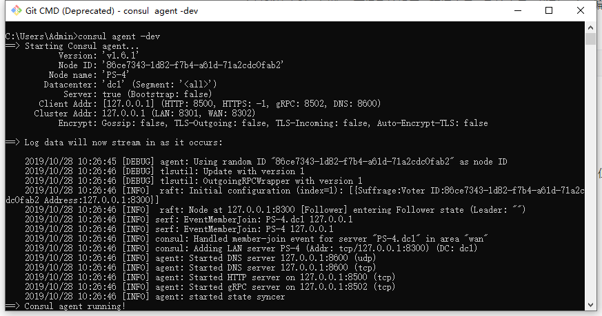
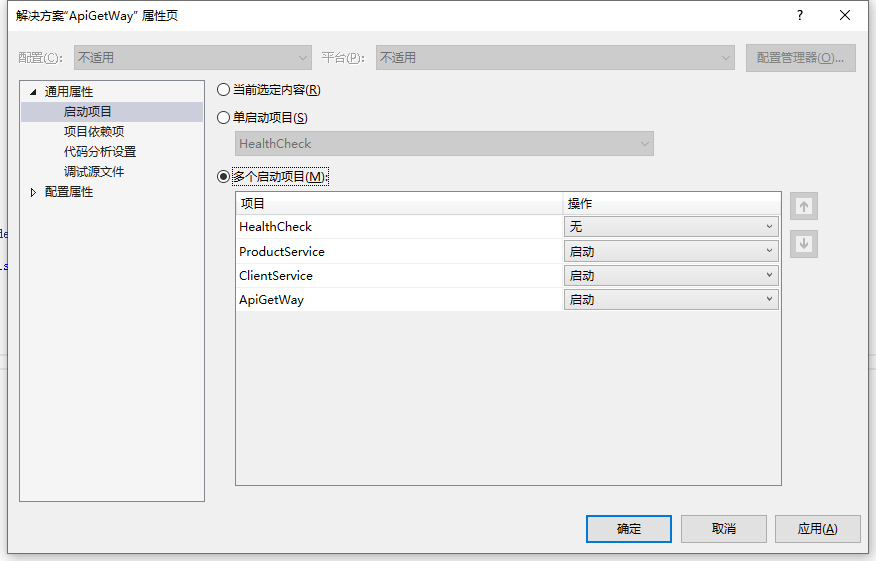

### 一、安装consul

官网下载文件解压，我解压的地址是  **D:\consul**  ，实际也只有一个consul.exe的可执行程序，这个exe直接执行的话会闪退。 所以要添加全局环境变量:

右键我的电脑->属性 ->高级系统设置->环境变量->系统变量->找到path->编辑->新建->输入 D:\consul

然后cmd命令:consul agent -dev



然后在浏览器里面 输入 localhost:8500  正常情况下可以看到consul启动成功了

**PS:我自己安装的时候有个问题，我的电脑是win10企业版， 64位操作系统，但是在下载安装64位的consul的安装包后 输入任何 consul命令，会都闪退，并且会自动删除掉 d盘consul文件夹里面的 consul.exe 文件**


### 二、测试.net core web api项目

新建一个 .net core web api的项目，取名 **HealthCheck**，这个项目来实现 服务的注册于健康检查

新增一个HealthController

```c#
using System;
using System.Collections.Generic;
using System.Linq;
using System.Threading.Tasks;
using Microsoft.AspNetCore.Http;
using Microsoft.AspNetCore.Mvc;

namespace HealthCheck.Controllers
{
    [Route("api/[controller]")]
    [ApiController]
    public class HealthController : ControllerBase
    {
        [HttpGet]
        public IActionResult Get() => Ok("ok");
    }
}
```

然后**Nuget 安装  Consul**

在appsetting.json中新增两个ip跟port 两个配置数据

```c#
{
  "port": "8810",
  "ip": "localhost",

  "Logging": {
    "LogLevel": {
      "Default": "Warning"
    }
  },
  "AllowedHosts": "*"
}

```

在Startup.cs中的添加代码

```
public void Configure(IApplicationBuilder app, IHostingEnvironment env, IApplicationLifetime lifetime)
        {
            if (env.IsDevelopment())
            {
                app.UseDeveloperExceptionPage();
            }
            else
            {
                // The default HSTS value is 30 days. You may want to change this for production scenarios, see https://aka.ms/aspnetcore-hsts.
                app.UseHsts();
            }

            app.UseHttpsRedirection();
            app.UseMvc();


            String ip = Configuration["ip"];//部署到不同服务器的时候不能写成127.0.0.1或者0.0.0.0，因为这是让服务消费者调用的地址
            int port = int.Parse(Configuration["port"]);//获取服务端口
            var client = new ConsulClient(ConfigurationOverview); //回调获取
            var result = client.Agent.ServiceRegister(new AgentServiceRegistration()
            {
                ID = "ServerNameFirst" + Guid.NewGuid(),//服务编号保证不重复
                Name = "ServerFirst",//服务的名称
                Address = ip,//服务ip地址
                Port = port,//服务端口
                Check = new AgentServiceCheck //健康检查
                {
                    DeregisterCriticalServiceAfter = TimeSpan.FromSeconds(5),//服务启动多久后反注册
                    Interval = TimeSpan.FromSeconds(10),//健康检查时间间隔，或者称为心跳间隔（定时检查服务是否健康）
                    HTTP = $"http://{ip}:{port}/api/Health",//健康检查地址
                    Timeout = TimeSpan.FromSeconds(5)//服务的注册时间
                }
            });


        }
        
        private static void ConfigurationOverview(ConsulClientConfiguration obj)
        {
            //consul的地址
            obj.Address = new Uri("http://127.0.0.1:8500");
            //数据中心命名
            obj.Datacenter = "dc1";
        }
```


然后 启动健康检查这个项目(consul已经启动了),可以看到健康检查这个项目里面定义的“ServerFirst”的已经在consul上面注册成功了，并且健康检查也是正常的


### 三、Ocelot+Consul

创建两个api的项目分别取名为 ClientService 、ProductService

代码与 HealthCheck 这个项目差不多，就不写了


然后创建一个 网关项目ApiGetWay

nuget 安装 Ocelot、Ocelot.Provider.Consul

然后修改Startup.cs

```c#
 public class Startup
    {
        public Startup(IConfiguration configuration)
        {
            Configuration = configuration;
        }

        public IConfiguration Configuration { get; }

        // This method gets called by the runtime. Use this method to add services to the container.
        public void ConfigureServices(IServiceCollection services)
        {
            services.AddOcelot(Configuration).AddConsul();
        }

        // This method gets called by the runtime. Use this method to configure the HTTP request pipeline.
        public void Configure(IApplicationBuilder app, IHostingEnvironment env)
        {
            if (env.IsDevelopment())
            {
                app.UseDeveloperExceptionPage();
            }

            app.UseOcelot().Wait();

        }
    }
```


新增一个配置文件 configuration.json

```c#
{
  "ReRoutes": [
    {
      "UseServiceDiscovery": true, 
      "DownstreamPathTemplate": "/api/{url}",
      "DownstreamScheme": "http",
      "ServiceName": "ClientService",
      "LoadBalancerOptions": {
        "Type": "RoundRobin"
      },
      "UpstreamPathTemplate": "/api/clientservice/{url}",
      "UpstreamHttpMethod": [ "Get", "Post" ],
      "ReRoutesCaseSensitive": false 
    },
    {
      "UseServiceDiscovery": true, 
      "DownstreamPathTemplate": "/api/{url}",
      "DownstreamScheme": "http",
      "ServiceName": "ProductService",
      "LoadBalancerOptions": {
        "Type": "RoundRobin"
      },
      "UpstreamPathTemplate": "/api/productservice/{url}",
      "UpstreamHttpMethod": [ "Get", "Post" ],
      "ReRoutesCaseSensitive": false 
    }
  ],
  "GlobalConfiguration": {
    "ServiceDiscoveryProvider": {
      "Host": "localhost", 
      "Port": 8500 
    }
  }
}
```

PS：这个配置文件里面有另外两段注释的配置，是Ocelot单独作为负载的时候使用的

最后是Program.cs

```c#
public class Program
    {
        public static void Main(string[] args)
        {
            BuildWebHost(args).Run();
        }
        
        public static IWebHost BuildWebHost(string[] args)
        {
            return WebHost.CreateDefaultBuilder(args)
                            .UseStartup<Startup>()
                            .UseUrls("http://localhost:5659/")
                            .ConfigureAppConfiguration((hostingContext, builder) =>
                            {
                                builder.AddJsonFile("configuration.json", false, true);
                            })
                            .Build();
        }
    }
```


启动项目 Clientservice、ProductSrvice、ApiGetWay




在 apigetway这个项目的url中输入  : https://localhost:44378/api/clientservice/values  地址就会跳转到

client 这个服务去了

